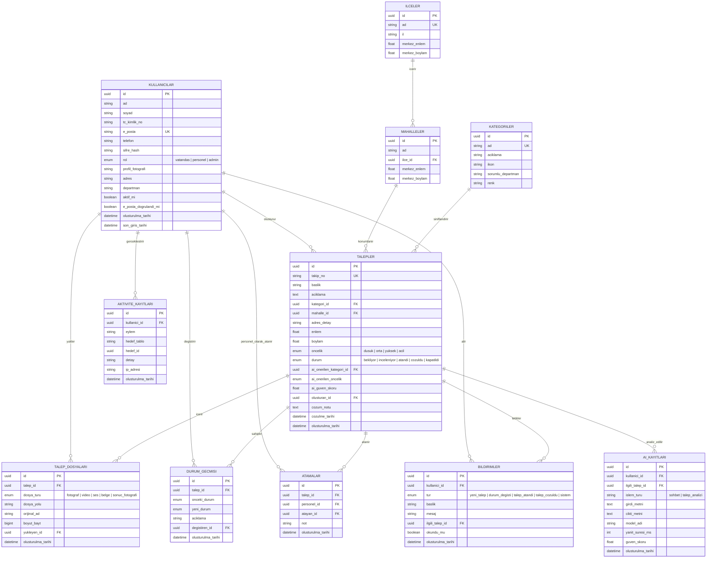

# Varlık-İlişki (ER) Diyagramı

Aşağıdaki diyagram, Kapaklı Akıllı Belediye Platformu veritabanının tüm tablolarını ve aralarındaki ilişkileri gösterir. GitHub ve çoğu Markdown görüntüleyici Mermaid diyagramlarını otomatik olarak çizer.

## Tasarım Notları

- **Birincil anahtarlar (PK):** Tüm tablolarda `UUID` kullanılır — dağıtık sistemlerde çakışma riskini ortadan kaldırır ve talep takip numaralarının tahmin edilmesini zorlaştırır.
- **`talepler.takip_no`:** Vatandaşa gösterilen okunabilir kod, örn. `KAP-2026-00042`. Uygulama katmanında üretilir, veritabanında `UNIQUE` olarak tutulur.
- **`durum_gecmisi`:** Bir talebin tüm yaşam döngüsü bu tablo üzerinden yeniden oluşturulabilir; `talepler.durum` alanı her zaman en güncel durumu, bu tablo ise tam geçmişi tutar.
- **`ai_kayitlari`:** Hem sohbet asistanı hem de otomatik kategori/öncelik önerisi işlemleri buraya loglanır; `ilgili_talep_id` boş olabilir (sohbet talebe bağlı olmayabilir).
- **Soft-delete yerine `aktif_mi`:** Kullanıcılar hiçbir zaman veritabanından silinmez; hesap `aktif_mi = false` yapılarak devre dışı bırakılır.
